# Warranty Label
# Extension for Magento 2
## Bedienungsanleitung

CopeX GmbH
Web: https://copex.io
Email: office@copex.io

---

## Inhaltsverzeichnis

1. [Einleitung](#1-einleitung)
2. [Voraussetzungen](#2-voraussetzungen)
3. [Einrichtung Schritt für Schritt](#3-einrichtung-schritt-für-schritt)
4. [Konfiguration](#4-konfiguration)
5. [Produktdaten des GARAN-Labels](#5-produktdaten-des-garan-labels)
6. [Garantiebedingungen als Anhang](#6-garantiebedingungen-als-anhang)
7. [Datenkontrolle](#7-datenkontrolle)
8. [Fehlerbehandlung](#8-fehlerbehandlung)
9. [Pflichten, die beim Betreiber bleiben](#9-pflichten-die-beim-betreiber-bleiben)

---

## 1 Einleitung

Ab dem **27. September 2026** verlangt die Durchführungsverordnung **(EU) 2025/1960** in Verbindung mit der Richtlinie **(EU) 2024/825** zwei neue Pflichtangaben im Online-Handel. Dieses Modul setzt beide um:

- **Der Gewährleistungshinweis** (Anhang I der Verordnung) ist eine offizielle Grafik, die jeder Shop zeigen muss, der Waren an Verbraucher verkauft. Sie informiert über die gesetzliche Gewährleistung und ist unabhängig davon verpflichtend, ob ein Hersteller zusätzlich eine Garantie gibt.
- **Das GARAN-Label** (Anhang II) betrifft nur einzelne Produkte: solche, für die der Hersteller eine kostenlose Haltbarkeitsgarantie für die gesamte Ware und für mehr als zwei Jahre gewährt.

Beide Grafiken sind amtlich vorgegeben. Das Modul liefert sie in allen 24 EU-Sprachen mit und verändert sie nie — weder Farben noch Schrift, Abstände oder QR-Code. Beim GARAN-Label werden ausschließlich die vier vorgesehenen Felder gefüllt: Marke, Modellkennung, Dauer und der Link auf die Garantiebedingungen.

Das Modul ist nach der Installation **ausgeschaltet**. Nichts erscheint im Shop, bevor Sie es bewusst aktivieren.

> Dieses Handbuch beschreibt die Bedienung. Es ersetzt keine Rechtsberatung. Welche Ihrer Produkte eine qualifizierende Herstellergarantie haben und wie die Anzeige rechtlich zu bewerten ist, entscheiden Sie beziehungsweise Ihre Rechtsberatung.

---

## 2 Voraussetzungen

| Komponente | Version |
|---|---|
| Magento 2 Open Source / Adobe Commerce | 2.4.x |
| PHP | ab 8.2 |
| PHP-Erweiterung GD | mit FreeType-Unterstützung |

Die GD-Erweiterung **muss mit FreeType übersetzt sein**. Das GARAN-Label wird serverseitig als Bild erzeugt, indem die Textfelder in die amtliche Vorlage gesetzt werden. Ohne FreeType kann das Modul keine Schrift zeichnen und erzeugt kein Label. Ob Ihre Installation geeignet ist, zeigt `php -i | grep -i freetype`.

Der Gewährleistungshinweis funktioniert auch ohne GD, weil er als fertige Grafik ausgeliefert wird.

### 2.1 Installation

```bash
composer require copex/module-warranty-label
bin/magento setup:upgrade
bin/magento setup:di:compile
bin/magento setup:static-content:deploy   # nur im Production-Modus nötig
bin/magento cache:flush
```

Nach der Installation ist im Shop noch nichts zu sehen. Die Einrichtung beschreibt Kapitel 3.

### 2.2 Deinstallation

```bash
bin/magento module:uninstall CopeX_WarrantyLabel --remove-data
```

**Der Zusatz `--remove-data` ist entscheidend.** Ohne ihn bleiben die vier GARAN-Attribute in der Datenbank
stehen, und deren hinterlegtes Backend-Modell verweist auf Klassen dieses Moduls. Eine Installation, die die
Dateien verliert, die Attributzeilen aber behält, beantwortet danach **jede Produktseite mit einem Fehler** —
denn jedes Laden von Produktattributen versucht, die nicht mehr vorhandene Klasse zu erzeugen.

Entfernt werden dabei: die vier Attribute samt ihrer Attributgruppe, alle Einstellungen unterhalb von
`copex_warrantylabel`, die Spalte `sales_order_item.copex_garan_label` und die zwischengespeicherten
Label-Grafiken unter `pub/media/copex_warranty_label/garan`.

**Nicht entfernt wird die hochgeladene PDF** mit den Garantiebedingungen unter
`pub/media/copex_warranty_label/terms`. Das ist Ihr Dokument, möglicherweise noch aus alten Bestellungen
verlinkt; löschen Sie es von Hand, wenn Sie es nicht mehr benötigen.

### 2.3 Themes

| Theme | Stand |
|---|---|
| **Luma** und **Blank** sowie davon abgeleitete Themes | Vollständig unterstützt. Alle Platzierungen wurden in beiden Themes auf dem Desktop (1280 px) und auf dem Smartphone (375 px) geprüft, einschließlich Bestellung, Erfolgsseite und E-Mail. |
| **Hyvä** | Teilweise. Der Hinweis im Modus *Direct* funktioniert in Header, Footer, Kategorie, Suche, Warenkorb und auf der Erfolgsseite. Die geschachtelte Anzeige, der Variantenwechsel auf der Produktseite und der Checkout benötigen Luma-Technik (RequireJS, Knockout) und sind für Hyvä noch nicht umgesetzt. Dieser Stand ist nicht in einer Hyvä-Installation abgenommen; prüfen Sie dort jede Platzierung nach Schritt 4 und 5. |
| **Eigener Checkout** (One-Step-Checkout, Bestell-Button außerhalb der Zahlungsart) | Hinweis und GARAN-Liste stehen in Magentos Bereich über dem Bestell-Button der gewählten Zahlungsart – an derselben Stelle wie die AGB-Checkboxen. Rendert Ihr Checkout diesen Bereich nicht, muss Ihre Agentur die beiden Komponenten im Projekt-Theme versetzen. Das Muster dafür steht in der `README.md` des Moduls, Abschnitt *Themes*. |

Ob Ihr Checkout betroffen ist, zeigt Schritt 5 der Einrichtung in wenigen Minuten.

---

## 3 Einrichtung Schritt für Schritt

Dieses Kapitel führt einmal vollständig durch die Einrichtung. Die Schritte 1 bis 5 betreffen den Gewährleistungshinweis und damit **jeden Shop**. Die Schritte 6 bis 9 brauchen Sie nur, wenn Sie Produkte mit einer qualifizierenden Herstellergarantie führen (siehe Abschnitt 5.1). Schritt 10 schließt die Einrichtung ab.

Richten Sie das Modul zuerst in einer Testumgebung ein und übertragen Sie die Einstellungen danach in den Live-Shop. Planen Sie für den Hinweis etwa eine halbe Stunde ein, für das GARAN-Label zusätzlich die Zeit für die Datenpflege.

### Schritt 1: Den Geltungsbereich wählen

Öffnen Sie *Stores → Configuration → Sales → EU Guarantee Notice & GARAN Label*.

Alle Felder des Moduls gelten **pro Store View**. Oben links steht der Umschalter **Scope**:

- In **Default Config** setzen Sie, was für alle Storefronts gleich sein soll – in der Regel den Hauptschalter und die Anzeigemodi.
- Im jeweiligen **Store View** setzen Sie, was sich unterscheidet – in der Regel die Sprache, die Garantiebedingungen und bei Bedarf den Button-Text.

Ein Feld, neben dem **Use Default** oder **Use system value** angehakt ist, übernimmt den Wert der darüberliegenden Ebene. Entfernen Sie den Haken, um es zu bearbeiten.

> Führen Sie Store Views für Marktplätze (Amazon, eBay …) oder für reine B2B-Storefronts, lassen Sie das Modul dort ausgeschaltet. Die Pflicht betrifft den Verkauf von Waren an Verbraucher.

### Schritt 2: Den Hinweis einschalten

Öffnen Sie die Gruppe **General Settings**.

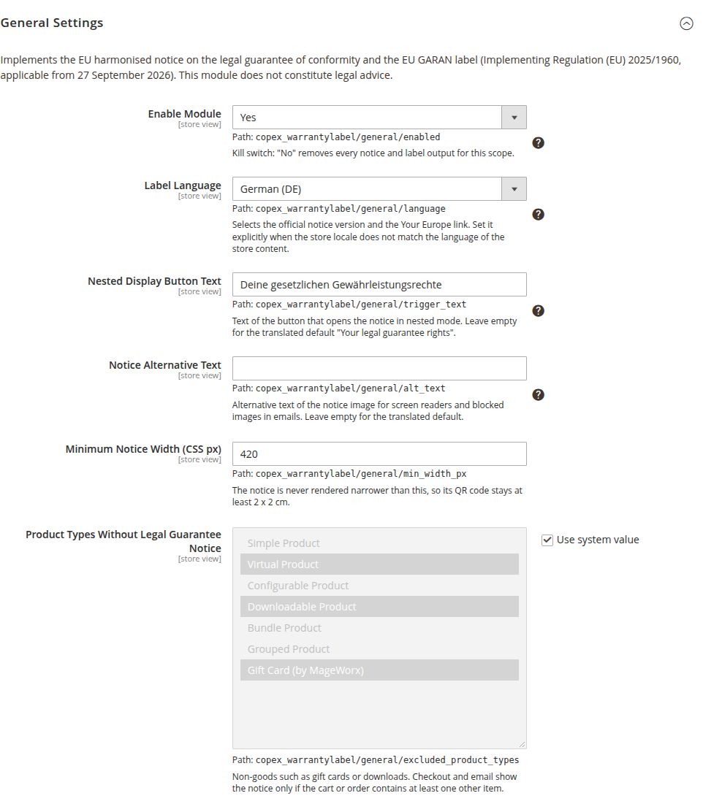

1. Stellen Sie **Enable Module** auf *Yes*.
2. Wählen Sie bei **Label Language** die Sprache, in der die Inhalte dieser Storefront verfasst sind. *Automatic* genügt, wenn die Locale des Store Views zur Sprache passt. Bei einer englischsprachigen Storefront auf deutscher Locale wählen Sie ausdrücklich *English*.
3. Lassen Sie **Nested Display Button Text** und **Notice Alternative Text** zunächst leer. Das Modul verwendet dann die übersetzten Standardtexte, im Deutschen „Ihre gesetzlichen Gewährleistungsrechte". Tragen Sie nur etwas ein, wenn Ihr Shop die Kunden duzt oder eine andere Formulierung verwendet.
4. Lassen Sie **Minimum Notice Width (CSS px)** auf *420*.
5. Prüfen Sie **Product Types Without Legal Guarantee Notice**. Verkaufen Sie Gutscheine oder Downloads über einen eigenen Produkttyp, der in der Liste nicht markiert ist, markieren Sie ihn zusätzlich (Strg-Klick).
6. Klicken Sie auf **Save Config**.

### Schritt 3: Die Platzierungen festlegen

Öffnen Sie die Gruppe **Legal Guarantee Notice Placements**.

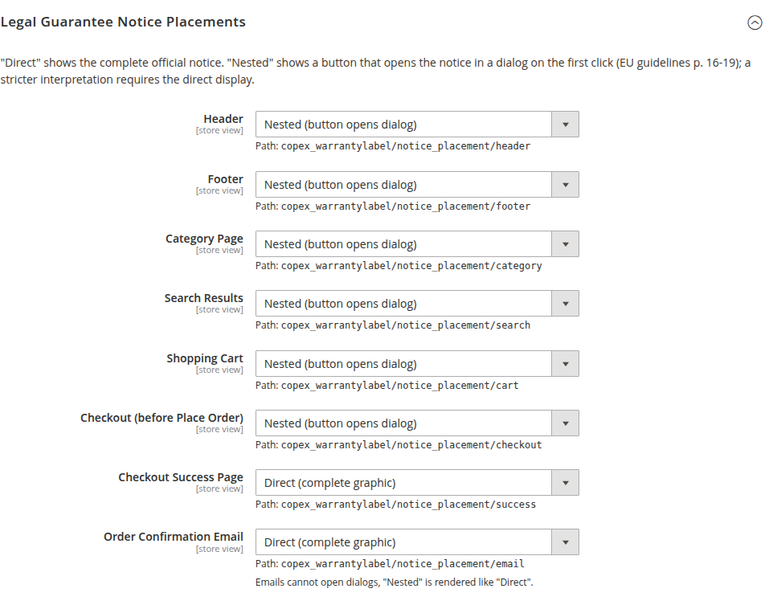

Jede Zeile ist eine Stelle im Shop, jede Stelle hat einen der vier Modi *Off*, *Direct*, *Nested* und *Dialog only* (siehe Abschnitt 4.2). **Ausgeliefert steht alles auf *Off*** — solange Sie hier nichts umstellen, bleibt der Shop unverändert. Einen Vorschlag, womit Sie anfangen, finden Sie in der Tabelle in Abschnitt 4.2.

| Platzierung | Wo der Hinweis in Luma erscheint |
|---|---|
| Header | In einer eigenen Zeile unter dem Logo, auf jeder Seite |
| Footer | Am Ende des Footers, auf jeder Seite |
| Category Page | Unter der Produktliste |
| Search Results | Unter den Suchergebnissen |
| Shopping Cart | In der Zusammenfassung, unter den Summen |
| Checkout (before Place Order) | Im Schritt *Zahlung*, in der gewählten Zahlungsart direkt über dem Bestell-Button |
| Checkout Success Page | Unter der Bestellbestätigung |
| Order Confirmation Email | Unter der Artikelliste der E-Mail |

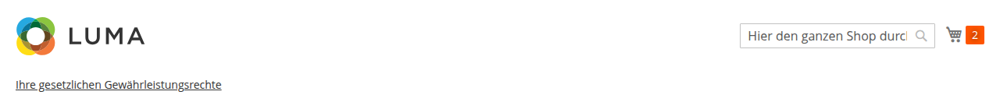

Header und Footer zeigen denselben Hinweis auf jeder Seite. Wenn Ihnen eine der beiden Stellen genügt, stellen Sie die andere auf *Off*. **Welche Platzierungen Sie brauchen und ob die geschachtelte Anzeige für Sie ausreicht, ist eine Rechtsfrage** – stimmen Sie die Auswahl mit Ihrer Rechtsberatung ab und halten Sie das Ergebnis fest.

Klicken Sie auf **Save Config**.

### Schritt 4: Cache leeren und den Hinweis im Shop prüfen

Leeren Sie unter *System → Cache Management* den Cache (**Flush Magento Cache**). Ohne diesen Schritt zeigen bereits zwischengespeicherte Seiten den Hinweis nicht.

Rufen Sie danach die Storefront auf und gehen Sie die Stellen durch – einmal am Desktop, einmal am Smartphone:

- [ ] Startseite: Button im Header und im Footer, ein Klick öffnet die vollständige Grafik, Escape oder *Schließen* schließt sie wieder
- [ ] eine Kategorieseite und eine Suchergebnisseite
- [ ] der Warenkorb mit mindestens einem Artikel
- [ ] die Sprache der Grafik passt zur Storefront
- [ ] der QR-Code lässt sich mit dem Smartphone vom Bildschirm scannen und führt auf die Seite der EU
- [ ] der Link unter der Grafik führt auf dieselbe Seite

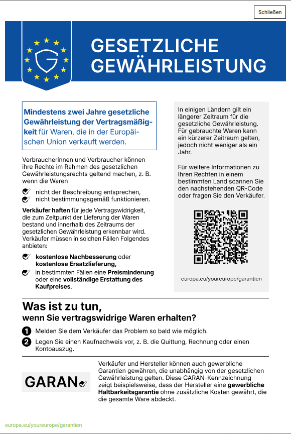

### Schritt 5: Den Checkout prüfen – mit jeder Zahlungsart

Legen Sie einen Artikel in den Warenkorb und gehen Sie bis zum Schritt *Zahlung*. Der Hinweis steht in der gewählten Zahlungsart, direkt über dem Bestell-Button und neben den AGB-Checkboxen.

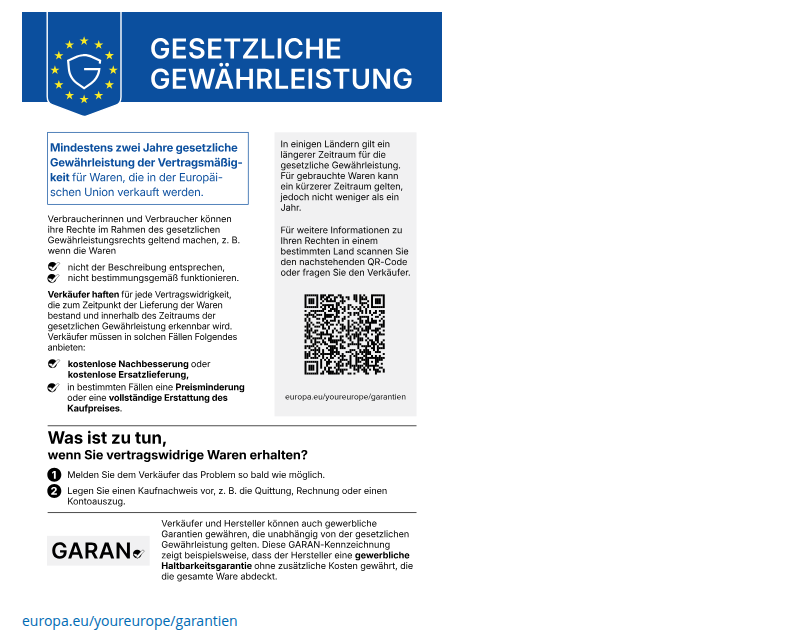

**Klicken Sie jede Zahlungsart Ihres Shops einmal an** und prüfen Sie, ob der Hinweis dort erscheint. Den Bereich über dem Bestell-Button gibt jede Zahlungsart selbst aus. Lässt das Modul eines Zahlungsanbieters ihn weg, fehlen bei dieser Zahlungsart der Hinweis **und** die AGB-Checkboxen. Wenden Sie sich in diesem Fall an Ihre Agentur (siehe Abschnitt 8.6).

Auf dem Smartphone ist der Checkout schmaler als die Mindestbreite der Grafik. Im Modus *Direct* lässt sich die Grafik dort seitlich verschieben; sie wird nie verkleinert oder beschnitten. Gefällt Ihnen das nicht, stellen Sie die Platzierung *Checkout* auf *Nested*.

**Haben Sie keine Produkte mit qualifizierender Herstellergarantie, fahren Sie mit Schritt 9 fort.**

### Schritt 6: Das GARAN-Label einschalten

Öffnen Sie die Gruppe **EU GARAN Label**.

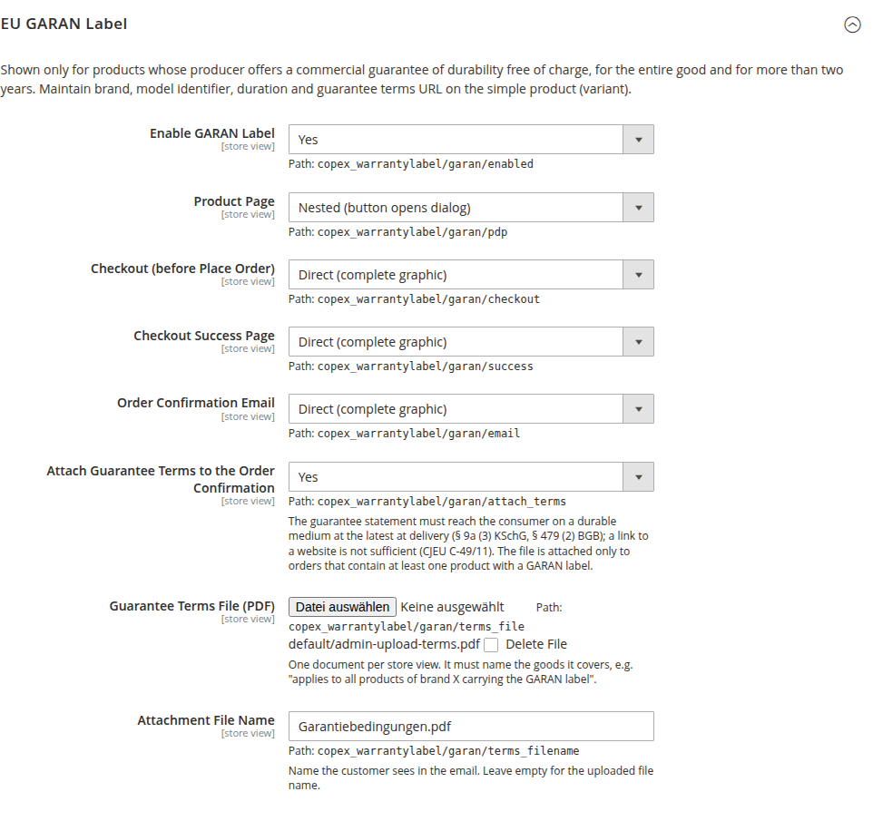

1. Stellen Sie **Enable GARAN Label** auf *Yes*.
2. Belassen Sie die vier Anzeigemodi zunächst auf der Voreinstellung: *Nested* auf der Produktseite, *Direct* im Checkout, auf der Erfolgsseite und in der E-Mail.
3. Klicken Sie auf **Save Config**.

Im Shop ändert sich dadurch noch nichts. Ein Label erscheint erst an Produkten, deren Daten Sie im nächsten Schritt pflegen.

### Schritt 7: Die Produktdaten pflegen

Öffnen Sie unter *Catalog → Products* ein **einfaches Produkt** und dort die Gruppe **EU GARAN Guarantee**.

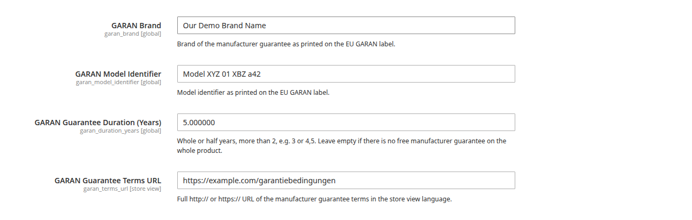

| Feld | Beispiel | Hinweis |
|---|---|---|
| GARAN Brand | `Musterwerk` | Die Marke, wie sie auf dem Label stehen soll |
| GARAN Model Identifier | `MW-2000-S` | Die Modellkennung des Herstellers für genau diese Variante |
| GARAN Guarantee Duration (Years) | `5` | Ganze Jahre von 3 bis 99. Halbe Jahre siehe Abschnitt 5.3 |
| GARAN Guarantee Terms URL | `https://www.example.com/garantie` | Vollständige Adresse. Das Feld gilt pro Store View: Wechseln Sie oben links den Store View, um je Sprache eine eigene Adresse zu hinterlegen |

Speichern Sie das Produkt. Lehnt Magento die Marke oder die Modellkennung ab, ist der Text zu breit für das Feld des Labels (siehe Abschnitt 8.2).

Bei **konfigurierbaren Produkten** pflegen Sie die Werte an den einzelnen Varianten, nicht am Elternprodukt. Bei vielen Produkten pflegen Sie die vier Attribute über den Import; die Attributcodes lauten `garan_brand`, `garan_model_identifier`, `garan_duration_years` und `garan_terms_url`.

Rufen Sie das Produkt danach in der Storefront auf. Unter dem Preis steht das Label als Button, ein Klick zeigt es vollständig. Bei einem konfigurierbaren Produkt erscheint es erst, nachdem eine Variante gewählt wurde.

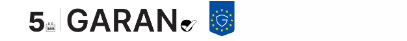

### Schritt 8: Die Garantiebedingungen hochladen

Die Garantiebedingungen müssen den Kunden als Datei erreichen, ein Link genügt nicht (siehe Kapitel 6). In der Gruppe **EU GARAN Label**:

1. Wechseln Sie oben links in den **Store View**, für den das Dokument gilt. Je Store View gibt es ein Dokument, passend zur Sprache.
2. Stellen Sie **Attach Guarantee Terms to the Order Confirmation** auf *Yes*.
3. Wählen Sie bei **Guarantee Terms File (PDF)** Ihre PDF-Datei aus.
4. Tragen Sie bei **Attachment File Name** den Namen ein, den der Kunde sehen soll, etwa `Garantiebedingungen.pdf`.
5. Klicken Sie auf **Save Config**. Erst dabei wird die Datei hochgeladen; danach steht ihr Pfad unter dem Feld.

Das Dokument muss selbst benennen, für welche Waren es gilt (siehe Abschnitt 6.2).

### Schritt 9: Eine Testbestellung ausführen

Bestellen Sie in der Testumgebung einmal bis zum Ende – mit GARAN-Label am besten ein Produkt mit und eines ohne Label.

- [ ] Im Checkout steht das Label am Artikel in der Bestellübersicht und gesammelt über dem Bestell-Button
- [ ] Die Erfolgsseite zeigt den Hinweis und die Labels der bestellten Artikel
- [ ] Die Bestellbestätigung enthält den Hinweis, je Artikel das Label mit beiden Links und die PDF-Datei als Anhang
- [ ] Eine Bestellung **ohne** Produkt mit Label enthält den Hinweis, aber keinen Anhang

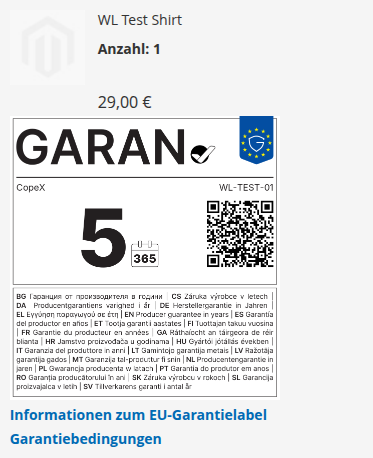

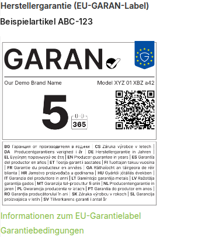

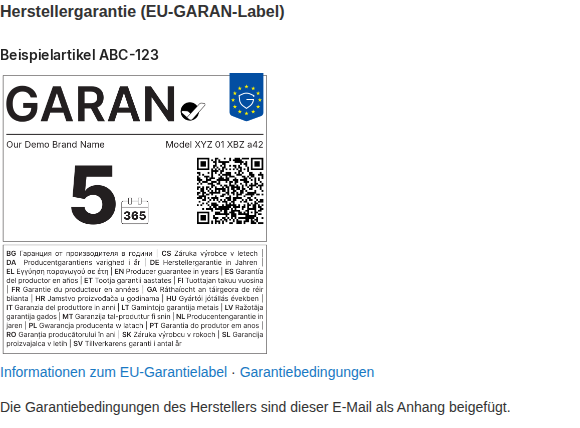

### Schritt 10: Daten prüfen und live schalten

Lassen Sie Ihre Agentur oder Ihren Administrator die Datenprüfung ausführen, je Store View einmal:

```bash
bin/magento copex:warranty-label:audit --store=<Store-View-Code>
```

Die Liste nennt jedes Produkt, das wegen unvollständiger oder ungültiger Daten **kein** Label zeigt, mit dem Grund (siehe Abschnitt 8.1). Ist die Liste leer, sind alle gepflegten Produkte vollständig.

Für den Live-Shop:

1. Übertragen Sie die Einstellungen aus den Schritten 2, 3 und 6. Ihre Agentur kann das per Kommandozeile erledigen; der Konfigurationspfad steht im Admin unter jedem Feld:

   ```bash
   bin/magento config:set --scope=stores --scope-code=<Store-View-Code> copex_warrantylabel/general/enabled 1
   bin/magento config:set --scope=stores --scope-code=<Store-View-Code> copex_warrantylabel/notice_placement/footer nested
   ```

   Die Werte der Anzeigemodi lauten `off`, `direct` und `nested`.
2. **Laden Sie die PDF-Datei im Live-Shop erneut im Admin hoch.** Die Kommandozeile kann Datei-Felder nicht setzen (siehe Abschnitt 6.1).
3. Leeren Sie den Cache.
4. Wiederholen Sie die Prüfungen aus den Schritten 4, 5 und 9 im Live-Shop.

Die Pflicht gilt ab dem **27. September 2026**. Der Hauptschalter **Enable Module** schaltet jede Ausgabe des Moduls in einem Geltungsbereich sofort wieder ab, falls im Live-Shop etwas nicht stimmt.

---

## 4 Konfiguration

Dieses Kapitel beschreibt jedes Feld im Einzelnen. Die Reihenfolge der Einrichtung steht in Kapitel 3.

Alle Einstellungen liegen unter *Stores → Configuration → Sales → EU Guarantee Notice & GARAN Label*. Der Bereich gilt **pro Store View**, sodass jede Storefront eine eigene Sprache und eigene Anzeigemodi haben kann.

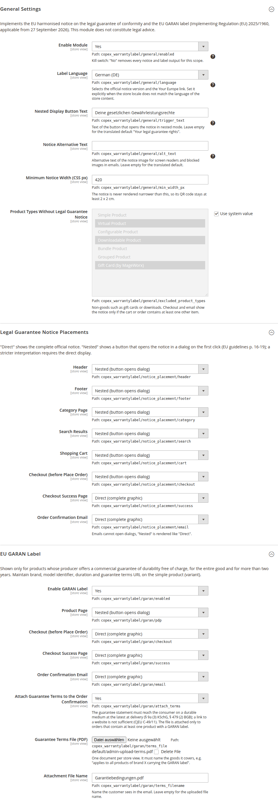

### 4.1 Allgemeine Einstellungen

- **Enable Module** — der Hauptschalter. Steht er auf *No*, erscheint in diesem Geltungsbereich weder ein Hinweis noch ein Label, unabhängig von allen anderen Einstellungen. *Standard: No.*
- **Label Language** — wählt die amtliche Sprachfassung des Hinweises und das Ziel des Links. *Automatic (from store locale)* leitet die Sprache aus der Store-Locale ab. Setzen Sie den Wert ausdrücklich, wenn die Locale nicht der Sprache Ihrer Shop-Inhalte entspricht — etwa bei einer englischsprachigen Storefront, die technisch auf `de_AT` läuft. Lässt sich keine Sprache bestimmen, greift Englisch.
- **Nested Display Button Text** — die Beschriftung des Buttons, der den Hinweis in der geschachtelten Anzeige öffnet. Leer lassen für den übersetzten Standardtext „Ihre gesetzlichen Gewährleistungsrechte".
- **Notice Alternative Text** — der Alternativtext der Grafik für Screenreader und für E-Mail-Programme, die Bilder blockieren. Leer lassen für den übersetzten Standardtext.
- **Minimum Notice Width (CSS px)** — die Grafik wird nie schmaler dargestellt als dieser Wert, damit ihr QR-Code scanbar bleibt. *Standard: 420.* Verkleinern Sie ihn nicht ohne Not: Bei geringerer Breite unterschreitet der QR-Code die geforderte Mindestgröße.
- **Product Types Without Legal Guarantee Notice** — Produkttypen, die keine Waren im Sinne der Gewährleistung sind, etwa Gutscheine oder Downloads. *Standard: Virtual, Downloadable, Gift Card, MageWorx Gift Cards.* Im Checkout und in der E-Mail erscheint der Hinweis nur, wenn mindestens ein anderer Artikel enthalten ist. Die übrigen Platzierungen, auch der Warenkorb, zeigen ihn unabhängig vom Inhalt.

### 4.2 Platzierungen des Gewährleistungshinweises

Für jede Platzierung im Shop wählen Sie einen von vier Modi:

| Modus | Bedeutung |
|---|---|
| **Off** | Keine Ausgabe an dieser Stelle. |
| **Direct (complete graphic)** | Die vollständige amtliche Grafik steht unmittelbar auf der Seite. |
| **Nested (button opens dialog)** | Ein Button öffnet die Grafik beim ersten Klick in einem Dialogfenster. |
| **Dialog only (place your own trigger)** | Wie *Nested*, aber ohne Button: Sie setzen den Auslöser selbst, siehe Abschnitt „Eigener Auslöser". |

Die beiden E-Mail-Felder kennen nur *Ja* und *Nein*, weil eine E-Mail keinen Dialog öffnen kann.

Die geschachtelte Anzeige ist nach den Leitlinien der EU-Kommission zulässig. Eine strengere Auslegung verlangt die unmittelbare Darstellung. Weil das eine Rechtsfrage ist, lässt das Modul die Entscheidung für jede Platzierung einzeln zu.

| Platzierung | Standard | Empfehlung |
|---|---|---|
| Header | Off | Nested |
| Footer | Off | Nested |
| Category Page | Off | Nested |
| Search Results | Off | Nested |
| Shopping Cart | Off | Nested |
| Checkout (before Place Order) | Off | Direct |
| Checkout Success Page | Off | Direct |
| Order Confirmation Email | Off | Ja |

Ausgeliefert wird alles ausgeschaltet: Ein frisch installiertes Modul verändert Ihren Shop an keiner Stelle. Die Spalte *Empfehlung* ist der Ausgangspunkt, den wir für einen typischen Shop vorschlagen — geschachtelt überall dort, wo die Grafik das Layout sprengen würde, direkt dort, wo der Kunde unmittelbar vor oder nach der Bestellung steht.

Zwei Hinweise zur Wahl des Modus:

- **Enge Container sprechen für „Nested".** Ist der verfügbare Platz schmaler als die eingestellte Mindestbreite, wird die direkte Grafik nicht verkleinert, sondern lässt sich seitlich verschieben – sie ist vollständig, wirkt aber abgeschnitten. Das betrifft vor allem den Checkout auf dem Smartphone. Im Dialog erscheint die Grafik dagegen in voller Größe.
- **In E-Mails gibt es keine Dialoge.** Die beiden E-Mail-Felder fragen deshalb nur, ob die Grafik mitgeschickt wird.
- **Attach the Notice Graphic to the Email** hängt dieselbe Grafik zusätzlich als PNG-Datei an. *Standard: Nein.* Das ist unabhängig vom Feld darüber und hilft dort, wo das E-Mail-Programm entfernte Bilder blockiert: Der Dateianhang bleibt sichtbar, auch wenn das eingebettete Bild leer bleibt. Dasselbe gibt es beim GARAN-Label, siehe Abschnitt 4.3.

Der Dialog ist vollständig mit der Tastatur bedienbar: Enter oder Leertaste öffnen ihn, Escape schließt ihn, und der Fokus kehrt anschließend auf den Button zurück.

#### Eigener Auslöser

Im Modus *Dialog only* liefert das Modul nur das Dialogfenster und überlässt Ihnen den Auslöser.
Jedes Element mit der Klasse `copex-wl-trigger` und einem `aria-controls` auf die Dialog-ID öffnet ihn, gleich wo es auf der Seite steht – in einem statischen Block, im Footer, in einer Vorlage Ihres Themes:

```html
<button type="button" class="copex-wl-trigger" aria-controls="copex-wl-notice-footer">
    Gesetzliche Gewährleistung
</button>
```

Die IDs des Hinweises lauten `copex-wl-notice-` plus Platzierung, also `copex-wl-notice-header`, `-footer`, `-cart`, `-category`, `-search`, `-checkout` und `-success`.
Das GARAN-Label auf der Produktseite hat die ID `copex-wl-garan-pdp`.
Auf der Erfolgsseite und im Checkout enthalten die GARAN-IDs die Artikelnummer des Bestellpostens; lesen Sie sie dort aus der gerenderten Seite ab.

Die Auslöser werden beim Laden der Seite gebunden. Ein Element, das ein eigenes Skript erst später einfügt, muss vorher im Dokument stehen.

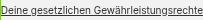


### 4.3 GARAN-Label

- **Enable GARAN Label** — schaltet das Label frei. *Standard: No.* Solange es ausgeschaltet ist, bleiben die Produktattribute erhalten, werden aber nirgends angezeigt.
- **Product Page** — *Standard: Off.*
- **Checkout (before Place Order)** — *Standard: Off.* Das Label erscheint an zwei Stellen: am jeweiligen Artikel in der Bestellübersicht und gesammelt in der gewählten Zahlungsart, direkt über dem Bestell-Button. Die zweite Stelle ist auf Mobilgeräten wichtig, wo die Bestellübersicht eingeklappt ist.
- **Checkout Success Page** — *Standard: Off.*
- **Order Confirmation Email** — *Standard: Nein.*
- **Attach the Label Graphics to the Email** — schickt zusätzlich je gekennzeichnetem Artikel eine PNG-Datei mit, benannt nach dessen SKU (`garan-label-<sku>.png`). *Standard: Nein.* Unabhängig vom Feld darüber.
- **Brand Comes From** — woher die Marke kommt, wenn das Produkt selbst keine `GARAN Brand` trägt. *Standard: GARAN Brand attribute of the product.*
  - *GARAN Brand attribute of the product* — nur das GARAN-Attribut.
  - *Another product attribute* — ein beliebiges anderes Produktattribut, das darunter im Feld **Brand Product Attribute** gewählt wird (alle Text-, Textarea- und Auswahlattribute stehen zur Wahl, etwa `manufacturer`). Bei Auswahlattributen wird die Options­beschriftung verwendet, nicht die Options-ID.
  - *Fixed value below* — ein fester Wert aus dem Feld **Brand**, sinnvoll für Shops mit nur einer Marke.
- **Model Identifier Comes From** — woher die Modellkennung kommt, wenn das Produkt selbst keine `GARAN Model Identifier` trägt. *Standard: GARAN Model Identifier attribute of the product.* Die Alternative *Product name* verwendet den Produktnamen.
- **Guarantee Terms URL** — eine Adresse für alle Produkte ohne eigene. *Standard: leer.*

Alle drei Felder füllen nur **leere** Produktwerte auf. Steht am Produkt etwas, gewinnt immer das Produkt.

> **Vorsicht bei langen Produktnamen.** Marke und Modellkennung teilen sich auf dem Label eine Zeile. Ein zu langer Wert wird nicht verkleinert, sondern abgelehnt — dann erscheint gar kein Label, ohne Fehlermeldung im Shop. Prüfen Sie nach der Umstellung auf *Product name* stichprobenartig mit `bin/magento copex:warranty-label:audit --store=<id>`; der Grund heißt dort `too_long`.

Die übrigen Felder der Gruppe betreffen den Anhang und sind in Kapitel 6 beschrieben.

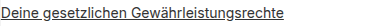


---

## 5 Produktdaten des GARAN-Labels

Das Modul erzeugt keine Garantiedaten. Es zeigt nur an, was Sie pflegen.

Bei der Installation entsteht in jedem Attributset die Gruppe **EU GARAN Guarantee** mit vier Attributen. Sie lassen sich an **jedem Produkttyp** pflegen und gelten je **Store View**, damit Marke und Bedingungen pro Sprache abweichen können.

| Attribut | Gültigkeitsbereich | Bedeutung |
|---|---|---|
| **GARAN Brand** | Store View | Die Marke, wie sie auf dem Label steht. |
| **GARAN Model Identifier** | Store View | Die Modellkennung, wie sie auf dem Label steht. |
| **GARAN Guarantee Duration (Years)** | Store View | Ganze oder halbe Jahre, mehr als 2, etwa `3` oder `4,5`. Leer lassen, wenn es keine kostenlose Herstellergarantie auf die gesamte Ware gibt. |
| **GARAN Guarantee Terms URL** | Store View | Vollständige `http://`- oder `https://`-Adresse der Garantiebedingungen in der Sprache der Storefront. |

Ein Label erscheint nur, wenn **alle vier Werte vorhanden und gültig** sind. Fehlt eines, zeigt das Modul nichts an — es zeigt niemals ein unvollständiges Label.


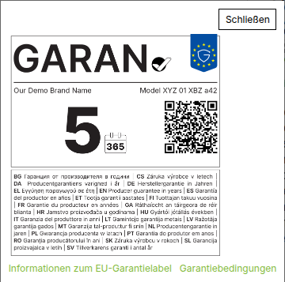

### 5.1 Wann ein Produkt überhaupt in Frage kommt

Das GARAN-Label ist kein Werbemittel, sondern eine Pflichtangabe für einen eng umrissenen Fall. Die Garantie muss

- vom **Hersteller** stammen (nicht vom Händler),
- für den Verbraucher **kostenlos** sein,
- die **gesamte Ware** abdecken (nicht nur einzelne Bauteile) und
- **länger als zwei Jahre** laufen.

Trifft auch nur eines davon nicht zu, darf kein Label gesetzt werden. Lassen Sie die Dauer dann leer.

### 5.2 Varianten

Bei konfigurierbaren Produkten hängen die Werte an der gewählten Variante. Das Modul zeigt deshalb

- **kein** Label, solange noch keine Variante gewählt ist,
- und wechselt das Label, sobald der Kunde eine andere Variante wählt.

**Vererbung.** Unterscheiden sich die Varianten nur in Größe oder Farbe, müssen Sie die vier Werte nicht an jeder einzelnen pflegen: Tragen Sie sie am konfigurierbaren Elternprodukt ein. Jede Variante, deren eigenes Feld leer ist, übernimmt den Wert des Elternprodukts. Ein am Kind gepflegter Wert gewinnt immer.

Trägt das Elternprodukt selbst vollständige Werte, zeigt es auch auf seiner eigenen Produktseite ein Label — das ist gewollt, wenn alle Varianten dieselbe Garantie haben. Soll am Elternprodukt keines erscheinen, lassen Sie dort mindestens ein Feld leer.

Bei Bundle-Produkten werden alle enthaltenen Artikel berücksichtigt.

### 5.3 Halbe Garantiejahre

Die Verordnung erlaubt halbe Jahre. In der amtlichen Schriftgröße passen jedoch nur ganze Jahre von 3 bis 99 sowie der Wert `7,5` in das dafür vorgesehene Feld. Andere Halbjahreswerte wie `2,5` oder `4,5` können Sie speichern, es entsteht aber **kein Label**, und die Datenprüfung nennt den Grund `duration_does_not_fit`.

Das ist Absicht. Die Alternative wäre, die Schrift zu verkleinern oder das Kalendersymbol zu verschieben — beides verstößt gegen die Gestaltungsvorgaben. Eine Klärung bei der EU-Kommission ist angestoßen.

### 5.4 Bestellte Ware behält ihr Label

Beim Abschluss einer Bestellung speichert das Modul die Labeldaten an der Bestellposition. Ändern Sie später ein Attribut, ändert das **alte Bestellungen nicht**. Ein erneut versandter Beleg zeigt weiterhin die Angaben, die zum Kaufzeitpunkt galten.

---

## 6 Garantiebedingungen als Anhang

Ein Link auf eine Webseite genügt rechtlich nicht. Die Garantieerklärung muss den Verbraucher **auf einem dauerhaften Datenträger** erreichen, spätestens bei der Lieferung (Art. 17 Abs. 2 der Richtlinie (EU) 2019/771, § 9a Abs. 3 KSchG, § 479 Abs. 2 BGB). Der Europäische Gerichtshof hat entschieden, dass eine Webseite, auf die nur verwiesen wird, diese Anforderung nicht erfüllt (Rechtssache C-49/11).

Das Modul hängt deshalb eine PDF-Datei an die Bestellbestätigung — und zwar nur bei Bestellungen, die mindestens ein Produkt mit GARAN-Label enthalten. Ein Zusatzmodul ist dafür nicht nötig.

Davon zu trennen sind die beiden **Grafik-Anhänge** (*Attach the Notice Graphic to the Email* und *Attach the Label Graphics to the Email*): Sie hängen dieselben Bilder an, die auch in der Mail stehen, und dienen der Lesbarkeit, nicht dem dauerhaften Datenträger. Die Garantieerklärung erfüllt nur das PDF.

### 6.1 Einrichtung

- **Attach Guarantee Terms to the Order Confirmation** — schaltet den Anhang ein. *Standard: No.*
- **Guarantee Terms File (PDF)** — die Datei. Ein Dokument je Store View.
- **Attachment File Name** — der Name, den der Kunde in der E-Mail sieht. Leer lassen für den Namen der hochgeladenen Datei. *Standard: `Garantiebedingungen.pdf`.*

**Die Datei muss im Admin hochgeladen werden.** Der Befehl `bin/magento config:set` kann Datei-Felder nicht beschreiben, weil im Hintergrund ein echter Upload erwartet wird. Ein per Kommandozeile gesetzter Wert bleibt wirkungslos.


### 6.2 Ein Dokument für mehrere Produkte

Ein Dokument je Store View genügt, solange darin steht, für welche Waren es gilt — etwa „gilt für alle Produkte der Marke X mit GARAN-Label". Benötigen Sie unterschiedliche Bedingungen für unterschiedliche Marken, fassen Sie diese in einem Dokument zusammen oder trennen Sie die Marken auf eigene Store Views.

Der Anhang ersetzt nicht den Link am Label. Beide sind vorgeschrieben: der Link für die Information vor dem Kauf, der Anhang für den dauerhaften Datenträger.

---

## 7 Datenkontrolle

Der folgende Befehl listet alle Produkte, deren GARAN-Daten unvollständig oder ungültig sind und die deshalb kein Label zeigen:

```bash
bin/magento copex:warranty-label:audit
```

| Option | Bedeutung |
|---|---|
| `--store=<ID oder Code>` | Prüft die Werte in diesem Store View. Ohne Angabe werden die Admin-Werte geprüft. |
| `--limit=<Anzahl>` | Bricht nach dieser Zahl beanstandeter Produkte ab. `0` bedeutet kein Limit. |

Die Ausgabe ist eine Tabelle mit SKU, Produkt-ID und den Gründen, gefolgt von einer Zusammenfassung, wie viele Produkte geprüft wurden.

Weil die Adresse der Garantiebedingungen pro Store View gilt, lohnt ein Lauf je Storefront:

```bash
bin/magento copex:warranty-label:audit --store=at
```

Führen Sie den Befehl nach jedem Massenimport aus. Werkzeuge, die direkt in die Datenbank schreiben, umgehen die Prüfung beim Speichern — das Modul prüft deshalb zusätzlich bei der Anzeige, sodass fehlerhafte Daten nie zu einem falschen Label führen, aber eben auch stillschweigend zu gar keinem.

---

## 8 Fehlerbehandlung

### 8.1 Es erscheint kein GARAN-Label

Die Datenprüfung aus Kapitel 7 nennt für jedes Produkt einen Grund:

| Grund | Bedeutung |
|---|---|
| `missing_brand` | Die Marke fehlt. |
| `missing_model_identifier` | Die Modellkennung fehlt. |
| `missing_duration` | Die Dauer fehlt. |
| `missing_terms_url` | Der Link auf die Garantiebedingungen fehlt. |
| `invalid_duration` | Die Dauer ist keine Zahl über 2 in Schritten von 0,5, oder sie liegt über 99. |
| `duration_does_not_fit` | Die Dauer ist zulässig, passt aber nicht in das Feld des Labels (siehe Abschnitt 5.3). |
| `invalid_terms_url` | Der Link ist keine vollständige `http://`- oder `https://`-Adresse. |
| `too_long` | Marke oder Modellkennung sind zu breit für das vorgesehene Feld. |

Meldet die Prüfung nichts und es erscheint trotzdem kein Label, prüfen Sie der Reihe nach: Ist *Enable Module* aktiv? Ist *Enable GARAN Label* aktiv? Steht die Platzierung nicht auf *Off*? Handelt es sich um ein einfaches Produkt beziehungsweise wurde eine Variante gewählt?

### 8.2 Marke oder Modellkennung werden abgelehnt

Die Felder des Labels haben eine feste Breite. Das Modul misst den Text in der amtlichen Schrift und lehnt zu breite Werte ab, statt die Schrift zu verkleinern. Kürzen Sie die Angabe — meist genügt es, Zusätze wie die Produktlinie wegzulassen.

### 8.3 Der Hinweis wirkt abgeschnitten

Der Container ist schmaler als die eingestellte Mindestbreite, typischerweise im Checkout auf dem Smartphone. Die Grafik ist vollständig vorhanden und lässt sich seitlich verschieben. Stellen Sie diese Platzierung auf *Nested*, wenn Sie das vermeiden möchten; im Dialog erscheint die Grafik in voller Größe. Verringern Sie nicht die Mindestbreite, sonst wird der QR-Code zu klein.

### 8.4 Die E-Mail enthält keinen Anhang

Der Anhang wird nur bei Bestellungen mitgeschickt, die mindestens ein Produkt mit GARAN-Label enthalten. Prüfen Sie außerdem, ob *Attach Guarantee Terms* im richtigen Store View aktiv ist und ob dort tatsächlich eine Datei hinterlegt wurde — ein über die Kommandozeile gesetzter Wert bleibt wirkungslos (siehe Abschnitt 6.1).

### 8.5 Die Sprache passt nicht zum Shop

Die Sprache des Hinweises folgt der Einstellung *Label Language*, nicht der Locale. Steht sie auf *Automatic*, wird die Locale des Store Views herangezogen. Bei einer englischsprachigen Storefront auf deutscher Locale setzen Sie die Sprache ausdrücklich.

### 8.6 Der Hinweis fehlt im Checkout

Prüfen Sie der Reihe nach:

1. **Steht die Platzierung *Checkout* auf *Off*?** Siehe Abschnitt 4.2.
2. **Enthält der Warenkorb nur Artikel ohne Gewährleistung?** Bei einem Warenkorb, der ausschließlich aus Gutscheinen, Downloads oder anderen ausgenommenen Produkttypen besteht, erscheint der Hinweis absichtlich nicht.
3. **Fehlt er nur bei einer bestimmten Zahlungsart?** Dann gibt das Modul dieses Zahlungsanbieters den Bereich über dem Bestell-Button nicht aus. Erkennbar ist das daran, dass bei dieser Zahlungsart auch die AGB-Checkboxen fehlen. Ihre Agentur kann das Template der Zahlungsart ergänzen oder den Hinweis an eine andere Stelle des Checkouts setzen.
4. **Fehlt er bei allen Zahlungsarten?** Dann verwendet Ihr Shop einen Checkout, der diesen Bereich nicht kennt – etwa einen One-Step-Checkout oder ein Theme mit Bestell-Button in der Seitenleiste. Ihre Agentur versetzt die beiden Komponenten im Projekt-Theme; das Muster steht in der `README.md` des Moduls, Abschnitt *Themes*.
5. **Wurde der Cache geleert?**

### 8.7 Nach der Aktivierung ist im Shop nichts zu sehen

Leeren Sie den Cache unter *System → Cache Management*. Prüfen Sie außerdem, ob Sie die Einstellung im richtigen Geltungsbereich vorgenommen haben: Ein Wert in *Default Config* wirkt nicht, wenn im Store View ein abweichender Wert gesetzt ist. Im Production-Modus müssen nach der Installation zusätzlich die statischen Dateien bereitgestellt werden (siehe Abschnitt 2.1).

---

## 9 Pflichten, die beim Betreiber bleiben

Das Modul stellt die vorgeschriebenen Angaben dar. Es beurteilt nicht, ob sie zutreffen. In Ihrer Verantwortung bleiben:

1. **Die Auswahl der Produkte.** Welche Ware eine qualifizierende Herstellergarantie trägt, entscheiden Sie anhand der Herstellerzusage.
2. **Die Pflege der Daten.** Marke, Modellkennung, Dauer und Bedingungen müssen aktuell sein. Läuft eine Garantiezusage aus, entfernen Sie die Werte.
3. **Der Inhalt der Garantiebedingungen.** Die hinterlegte PDF-Datei ist Ihr Dokument; das Modul prüft weder Inhalt noch Vollständigkeit.
4. **Die Wahl zwischen direkter und geschachtelter Anzeige.** Das ist eine Rechtsfrage, die Sie mit Ihrer Rechtsberatung klären sollten.
5. **Marktplätze.** Auf Amazon, eBay und vergleichbaren Kanälen liegt die Darstellungspflicht beim jeweiligen Marktplatz. Für Store Views, die solche Kanäle bedienen, schalten Sie das Modul aus.

Eine vollständige Gegenüberstellung der rechtlichen Anforderungen und ihrer Umsetzung liegt dem Modul als Datei `docs/COMPLIANCE-DE.md` bei. Dieses Dokument richtet sich an Ihre Rechtsberatung.
